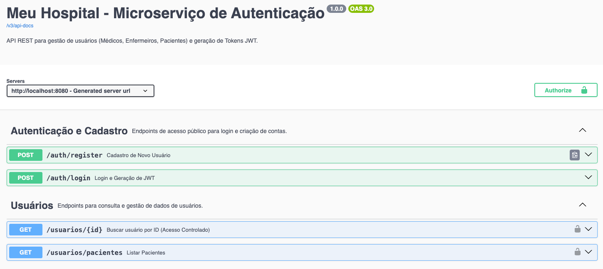
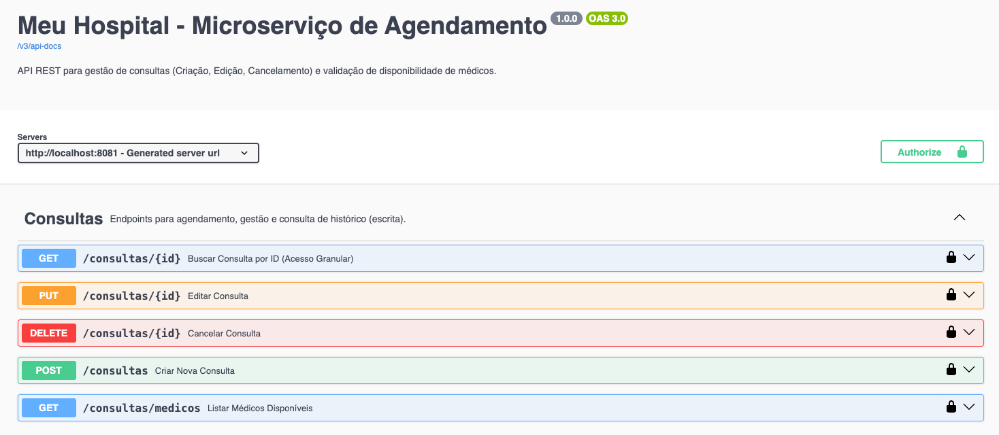
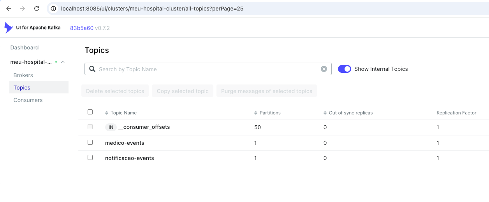
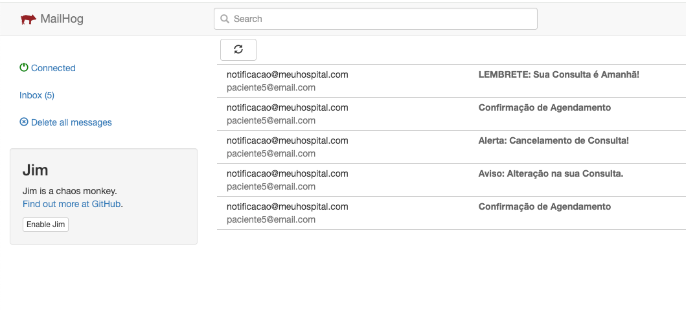
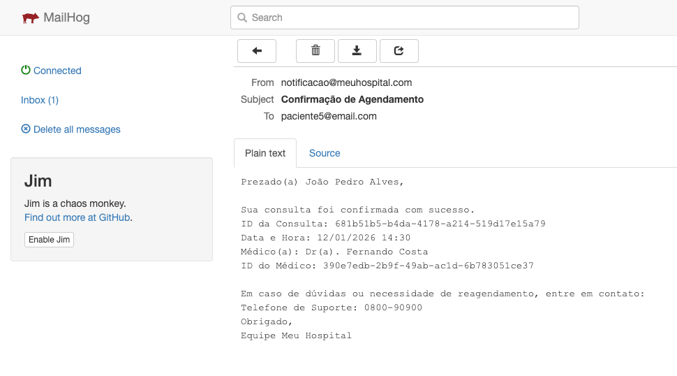
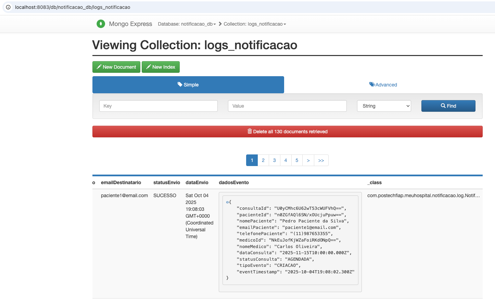

# 🏥 Meu Hospital: Documentação de Arquitetura de Microsserviços


# ⚙️ Como Iniciar o Projeto (Setup Guide)

Este projeto utiliza o **Docker Compose** para orquestrar todos os microsserviços e suas dependências (PostgreSQL, Kafka, MongoDB, MailHog) em um único comando.

## Pré-requisitos

Para rodar o projeto, você deve ter instalados:

1.  **Docker** e **Docker Compose** (Obrigatório para iniciar a infraestrutura).
2.  **Java 21** e **Maven 3.8+** (Necessário para compilar o código antes do Docker).

-----

##  Configuração de Credenciais (`.env` File)

O projeto requer que você crie um arquivo de ambiente (`.env`) na **raiz do seu mono-repo** para injetar credenciais e URLs. Este arquivo protege dados sensíveis e é ignorado pelo Git.

1.  Crie um arquivo chamado **`.env`** na raiz do projeto.
2.  Preencha-o com as variáveis abaixo. **Mantenha os valores das chaves secretas longos e seguros\!**

```bash
# ==========================================================
# CONFIGURAÇÕES DE INFRAESTRUTURA E CREDENCIAIS
# ==========================================================

# 1. CREDENCIAIS GERAIS DO BANCO DE DADOS (Postgres e Mongo)
DB_USERNAME=user
DB_PASSWORD=password

# 2. NOMES DOS BANCOS DE DADOS
AUTENTICACAO_DB_NAME=autenticacao_db
AGENDAMENTO_DB_NAME=agendamento_db
HISTORICO_DB_NAME=historico_db
MONGODB_DB=notificacao_db

# 3. SEGURANÇA (JWT)
# As chaves secretas são injetadas diretamente nos microsserviços.
JWT_SECRET="chave-secreta-muito-longa-e-segura-para-assinatura-jwt-meuhospital-2025-a1b2c3d4e5f6g7h8"
JWT_EXPIRATION_MS=3600000 # 1 hora
INTERNAL_SECRET="segredo-interno-muito-seguro-para-comunicacao-entre-microservicos-2025"

# 4. CONFIGURAÇÕES MONGODB (Para Injeção de Credenciais)
MONGODB_USER=user
MONGODB_PASSWORD=password

# 5. CONFIGURAÇÃO DE HOSTS E PORTAS (Uso local/opcional)
# ATENÇÃO: Os microsserviços usam 'kafka:9092' internamente. Estes são para acesso externo/UI.
DB_HOST=localhost
DB_PORT=5432
KAFKA_HOST=localhost
KAFKA_PORT_EXTERNAL=9093 # Porta externa para acesso ao Kafka (ex: Kafka UI)
MAILHOG_PORT_SMTP=1025 # Porta SMTP para envio de emails
```

-----

## Inicialização do Projeto

Siga os passos de compilação e orquestração para colocar a arquitetura no ar:

### Passo A: Compilação dos JARs

Execute o Maven para compilar o código Java, gerar o módulo de contratos e empacotar cada microsserviço:

```bash
mvn clean install -DskipTests
```

### Passo B: Subir a Infraestrutura (Docker Compose)

O Docker Compose irá criar redes virtuais, provisionar os bancos de dados, o Kafka e, em seguida, construir as imagens dos microsserviços a partir dos JARs gerados.

```bash
docker-compose up --build -d
```

O flag `-d` executa tudo em *background*. Use `docker-compose logs -f` para monitorar a inicialização.

-----

## Acesso e Observabilidade

Após a inicialização completa, acesse as ferramentas de observabilidade e os *endpoints* da aplicação:

| Serviço | Função | Porta Padrão | URL de Acesso |
| :--- | :--- | :--- | :--- |
| **MS Autenticação (REST)** | Login e Cadastro | `8080` | `http://localhost:8080` |
| **MS Agendamento (REST)** | Criação/Gestão de Consultas | `8081` | `http://localhost:8081` |
| **MS Histórico (GraphQL)** | Consultas de Leitura | `8084` | `http://localhost:8084/graphiql` |
| **MailHog (UI de E-mail)** | Caixa de Entrada Virtual | `8025` | `http://localhost:8025` |
| **Kafka UI** | Monitoramento de Tópicos e Mensagens | `8085` | `http://localhost:8085` |

**Próxima etapa:** Use a **Coleção do Postman** importada para executar os fluxos de trabalho (`Login`, `Agendamento`, `Cancelamento`) e verificar as notificações no MailHog.

## 🎯 I. Arquitetura

Este projeto implementa o backend do **Meu Hospital** como uma arquitetura de microsserviços em um **Mono-repo Multi-módulo**. O design é focado na resiliência e no desacoplamento, utilizando os padrões:

* **CQRS (Command Query Responsibility Segregation) Light:** Separação da lógica de escrita (Comando) e leitura (Query) em serviços e modelos de dados dedicados.
* **Comunicação Event-Driven:** Utilização de eventos assíncronos via **Kafka** para garantir o baixo acoplamento entre os domínios de **Autenticação**, **Agendamento**, **Notificação** e **Histórico**.

### 1.1. Decisão Estratégica: Mono-repo Maven

A escolha por um repositório único com múltiplos módulos Maven foi uma decisão arquitetural crucial para a **saúde** e **rastreabilidade** do projeto:

| Vantagem | Detalhe |
| :--- | :--- |
| **Versionamento Unificado** | O **POM Pai** centraliza as versões de todos os *frameworks* e dependências (Spring Boot, Kafka, JJWT), garantindo a compatibilidade em todo o ecossistema. |
| **Refatoração Atômica** | Mudanças críticas no módulo de Contratos são **imediatamente validadas** em todos os serviços no momento do *build*, eliminando falhas de dependência em tempo de execução (Princípio *Fail-Fast*). |

### 1.2. Módulo de Contratos (`meuhospital-contracts`)

Este módulo é a espinha dorsal do **desacoplamento**. Ele contém **exclusivamente** o mínimo necessário para a comunicação, isolando a regra de negócio dos vizinhos:

* **DTOs:** (Ex: `LoginRequest`, `ConsultaRequest`, `UsuarioResponse`).
* **Enums:** (Ex: `Role`).
* **Eventos Kafka:** (Ex: `MedicoEvent`, `ConsultaCriadaEvent`).

-----

## Ⅱ. Stack Tecnológico e Containers

O ambiente de desenvolvimento (DevOps) é totalmente orquestrado via **Docker Compose**, utilizando variáveis de ambiente injetadas pelo arquivo `.env` (padrão profissional de segurança).

### 2.1. Tecnologias Core

| Camada | Tecnologia | Implementação Específica |
| :--- | :--- | :--- |
| **Linguagem & Framework** | Java 21, Spring Boot 3.5.x | Uso de *Records* (DTOs) e Injeção por Construtor (DDD). |
| **Mensageria** | Apache Kafka / Zookeeper | Assincronicidade para notificação e padrões CQRS/Saga. |
| **Persistência Relacional** | PostgreSQL (JPA) | Utilizado por `ms-autenticacao`, `ms-agendamento`, `ms-historico` (isolados por domínio). |
| **Persistência NoSQL** | MongoDB | **Auditoria de logs** e rastreamento (ms-notificacao). |
| **Client Síncrono** | WebClient | Comunicação *Service-to-Service* **não-bloqueante** (reativa). |
| **Documentação** | Springdoc OpenAPI (Swagger) | Documentação REST (8080/8081) e GraphQL. |

### 2.2. Containers e Monitoramento (Observabilidade)

A infraestrutura de suporte ao desenvolvimento e observabilidade.

| Container | Função | Porta Exp. | Credencial de Acesso |
| :--- | :--- | :--- | :--- |
| `ms-autenticacao` | Identity Service, Produtor Kafka | 8080 | - |
| `ms-agendamento` | Business Logic, Orquestrador | 8081 | - |
| `ms-historico` | Read-Model, API GraphQL | 8084 | - |
| **`mailhog`** | Servidor SMTP Falso | **8025** | Acesso Livre via Web UI |
| **`mongodb`** | Log de Auditoria | 27017 | `user` / `password (admin)` |
| **`mongo-express`** | UI de Auditoria MongoDB | **8083** | `user_express` / `password_express` |
| **`kafka-ui`** | Monitoramento Kafka | **8085** | Acesso Livre via Web UI |

-----

## III. Fluxos Críticos e Detalhe da Comunicação

O sistema opera com fluxos transacionais que exigem diferentes mecanismos de comunicação (Síncrono RPC vs. Assíncrono Event-Driven).

### 3.1. Fluxo 1: Sincronização de Médicos (CQRS/Read-Model)

O objetivo é evitar que o `ms-agendamento` precise fazer chamadas síncronas para o `ms-autenticacao` para buscar dados de médicos, usando o padrão CQRS para ter uma **projeção de dados locais**.

| Serviço | Ação | Mecanismo | Detalhe |
| :--- | :--- | :--- | :--- |
| `ms-autenticacao` | Publica o cadastro de médico. | **Kafka Produtor** (`MedicoProducer`) | Envia o `MedicoEvent` (ID, nome, CRM, especialidade). |
| `ms-agendamento` | Consome e Armazena. | **Kafka Consumidor** (`MedicoConsumer`) | Salva/Atualiza a **`MedicoProjection`** local em seu DB PostgreSQL. |

### 3.2. Fluxo 2: Criação de Consulta (Transacional Híbrida)

O fluxo de escrita exige validação externa (Síncrona) e, em seguida, disparo de notificação (Assíncrono).

| Serviço | Ação | Mecanismo | Detalhe |
| :--- | :--- | :--- | :--- |
| `ms-agendamento` | Validação de Existência do Paciente. | **RPC Síncrono (WebClient)** | Chamada `GET /usuarios/{id}` para `ms-autenticacao` para buscar o nome/contato e confirmar a existência. |
| `ms-agendamento` | Validação de Regras. | **Lógica de Domínio** | Verifica a disponibilidade na tabela local (`MedicoProjection` e `Consulta`). |
| `ms-agendamento` | Disparo de Notificação. | **Kafka Produtor** (`ConsultaProducer`) | Publica `ConsultaCriadaEvent` no tópico `notificacao-events`. |

### 3.3. Fluxo 3: Cancelamento e Jobs Agendados

#### Cancelamento de Consulta (`DELETE` Lógico)

1.  O `ms-agendamento` recebe o comando `DELETE /consultas/{id}` (requer **MÉDICO/ENFERMEIRO**).
2.  O `ConsultaService` faz uma chamada **síncrona** ao `ms-autenticacao` para recuperar o E-mail e Telefone do paciente.
3.  O status da entidade `Consulta` é alterado para **CANCELADA** no DB.
4.  O serviço publica um evento **CANCELAMENTO** no Kafka.

#### Disparo de Lembrete (`@Scheduled`)

* **Job:** O `ms-agendamento` executa um Job (`@Scheduled`) diariamente às **18:00** (Job Lembrete).
* **Ação:** O Job busca consultas agendadas para o dia seguinte e publica um evento de tipo **LEMBRETE** no Kafka, acionando o `ms-notificacao`.

-----

## IⅤ. Segurança e Autorização (Regras)

### 4.1. Mecanismo JWT (`SecurityFilter`)

O filtro de segurança está replicado em `ms-autenticacao`, `ms-agendamento` e `ms-historico`.

* **Função:** Valida o JWT recebido, extrai as *claims* (`id`, `role`) e injeta no **`SecurityContext`**.
* **Decisão de Filtro:** A injeção dos filtros (`addFilterBefore(..., UsernamePasswordAuthenticationFilter.class)`) garante que a autenticação JWT ocorra **antes** de qualquer verificação de formulário padrão.

### 4.2. Chave Secreta (*Firewall Service-to-Service*)

Para proteger rotas internas críticas, como a busca de dados de usuário por ID:

1.  O `ms-agendamento` envia o *header* **`X-Internal-Secret`** (lido do `.env`) em requisições para `ms-autenticacao`.
2.  O `ms-autenticacao` utiliza o **`InternalServiceFilter`** para verificar essa chave.
3.  Se a chave for válida, o acesso é permitido na rota `GET /usuarios/{id}`; caso contrário, a requisição é bloqueada com **`401 Unauthorized`**.

-----

## V. Entregáveis e Estrutura de Arquivos

### 5.1. Documentação Swagger (OpenAPI JSON)

A documentação da API é gerada automaticamente pelo **Springdoc** e é o principal entregável para a comunicação de *endpoints*.

| Serviço | URL de Teste Swagger/GraphQL |
| :--- | :--- |
| `ms-autenticacao` | `http://localhost:8080/swagger-ui.html` |
| `ms-agendamento` | `http://localhost:8081/swagger-ui.html` |


http://localhost:8080/swagger-ui/index.html |
URL OpenAPI JSON:  http://localhost:8080/v3/api-docs
-----


http://localhost:8081/swagger-ui/index.html |
URL OpenAPI JSON:  http://localhost:8081/v3/api-docs
-----

### 5.2. Estrutura de Pastas (Hierarquia Completa)

#### Estrutura do Projeto Global (Mono-repo Multi-módulo)

```bash
meu-hospital-mono-repo/
├── meuhospital-contracts/     # Módulo de Contratos (DTOs, Enums, Eventos Kafka)
│   └── pom.xml                # Dependência crucial para todos os microsserviços
├── ms-autenticacao/           # Identity Service (Autenticação JWT)
├── ms-agendamento/            # Business Logic e Orquestração
├── ms-historico/              # Read-Model e API GraphQL
├── ms-notificacao/            # Event Listener e Auditoria
└── pom.xml                  # POM Pai (Gerencia versões e dependências globais)
```

#### `ms-autenticacao` (Identity Service)

Gerencia usuários, roles (perfis) e a emissão de tokens JWT.

```bash
ms-autenticacao/
├── src/main/java/com/postechfiap/meuhospital/autenticacao/
│   ├── controller/         # UsuarioController, AuthController (REST APIs de Login/Cadastro)
│   ├── service/impl/       # UsuarioServiceImpl (Lógica de Negócio, Criptografia de Senha)
│   ├── repository/         # Interfaces JPA (PostgreSQL para dados de usuário)
│   ├── security/           # Filtros JWT, Handlers 401/403, InternalServiceFilter
│   └── kafka/              # MedicoProducer (Publica eventos de cadastro/atualização de Médico)
├── src/main/resources/      # application.yaml, arquivos de credencial
└── pom.xml
```

#### `ms-agendamento` (Orquestrador de Consultas)

Gerencia o agendamento, atualização e cancelamento de consultas médicas.

```bash
ms-agendamento/
├── src/main/java/com/postechfiap/meuhospital/agendamento/
│   ├── controller/         # ConsultaController (Endpoints REST: POST/PUT/DELETE)
│   ├── service/impl/       # ConsultaService (Lógica Transacional, Validações Híbridas)
│   ├── repository/         # Interfaces JPA (PostgreSQL para Consultas)
│   ├── projection/         # MedicoProjection (CQRS Read Model, consumido do Kafka)
│   ├── kafka/              # ConsultaProducer (Publica eventos CRIACAO, CANCELAMENTO, LEMBRETE)
│   └── scheduler/          # JobLembrete (@Scheduled - Disparo diário de lembretes)
├── src/main/resources/      # application.yaml, .env
└── pom.xml
```

#### `ms-notificacao` (Consumidor de Eventos e Simulador de E-mail)

Responsável por consumir eventos Kafka e simular o envio de e-mails.

```bash
ms-notificacao/
├── src/main/java/com/postechfiap.meuhospital.notificacao/
│   ├── kafka/              # NotificacaoConsumer (Consome eventos do tópico notificacao-events)
│   ├── service/impl/       # EmailService (Integração com MailHog/SMTP)
│   ├── repository/         # Interfaces para persistência MongoDB (Auditoria/Logs)
│   └── model/              # Documentos MongoDB (Ex: LogAuditoria)
├── src/main/resources/      # application.yaml, configuração do MongoDB
└── pom.xml
```

#### `ms-historico` (Read-Model via GraphQL)

Fornece uma API GraphQL para consultas históricas de agendamentos.

```bash
ms-historico/
├── src/main/java/com/postechfiap.meuhospital.historico/
│   ├── graphql/            # Controller/DataFetcher para queries/mutations GraphQL
│   ├── service/impl/       # HistoricoService (Lógica de Consulta/Filtro)
│   ├── repository/         # Interfaces JPA (PostgreSQL dedicado para Histórico)
│   └── kafka/              # ConsultaConsumer (Consome eventos de CRIACAO/CANCELAMENTO para alimentar a base)
├── src/main/resources/      # application.yaml
└── pom.xml
```

### 5.3. Detalhe do Fluxo de E-mail (MailHog)

A simulação de e-mail é rastreável e visível na interface do **MailHog (Porta 8025)**, sendo acionada pelo `ms-notificacao` ao consumir eventos Kafka.

| Tipo de Evento | Rota de Disparo (ms-agendamento) | E-mail Enviado |
| :--- | :--- | :--- |
| **CRIACAO** | `POST /consultas` | Confirmação de agendamento. |
| **ATUALIZACAO** | `PUT /consultas/{id}` | Alerta de alteração de horário. |
| **CANCELAMENTO** | `DELETE /consultas/{id}` | Notificação de cancelamento. |
| **LEMBRETE** | Job `@Scheduled` | Lembrete de consulta para o dia seguinte. |

-----

## VI. Observabilidade e Auditoria (Visuais Essenciais)

### 6.1. Fluxos de Mensageria (Kafka-UI - Porta 8085)

* **Imagem 1: Tópicos Ativos no Kafka-UI**
    * **Descrição:** Lista de tópicos (`notificacao-events`, `medico-events`) com contagem de mensagens, confirmando que os produtores estão funcionando e os dados estão sendo armazenados.
      Acesse: http://localhost:8085/ui/clusters/meu-hospital-cluster/all-topics

### 6.2. Comunicação Assíncrona (MailHog - Porta 8025)

* **Imagem 2: Caixa de Entrada do MailHog com Múltiplos E-mails**
    * **Descrição:** UI do MailHog com e-mails de diferentes tipos: `Confirmação de Agendamento` (Criação), `Alerta de Alteração` (Atualização), `Notificação de Cancelamento` e `Lembrete de Consulta`. Isso prova que o `ms-notificacao` consome todos os eventos de forma correta.
    Acesse: http://localhost:8025/#]


* **Imagem 3: Detalhe de um E-mail de Confirmação**
    * **Descrição:** Mostrar o corpo de um e-mail específico (ex: Confirmação de Agendamento) para validar que o serviço de notificação utiliza os dados do evento corretamente.

### 6.3. Logs e Provas de Auditoria (Mongo-Express - Porta 8083)

* **Imagem 4: Visualização de Logs no Mongo-Express**
    * **Descrição:** Interface do Mongo-Express exibindo o conteúdo de um documento na coleção de `LogAuditoria` (mantida pelo `ms-notificacao`), comprovando que o MongoDB está ativo e registrando as operações de eventos (por exemplo, "Evento de Criação de Consulta consumido e processado").
Acesse: http://localhost:8083/db/notificacao_db/logs_notificacao

-----
